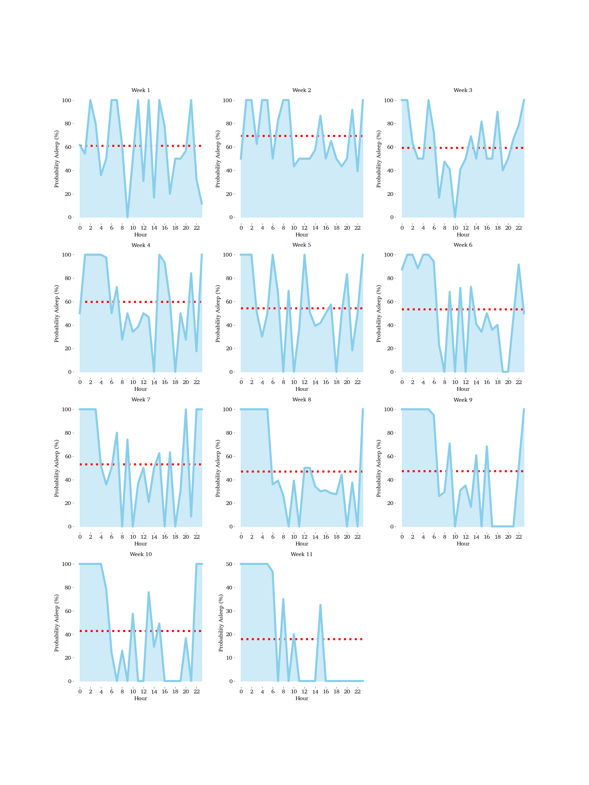
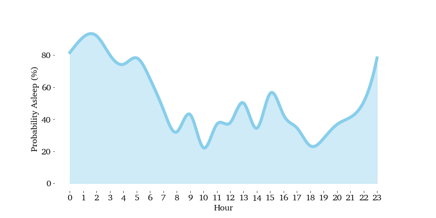

# eva
First ~11 months of sleep and feed log for a newborn. 🥚 -> 🐣 -> 🐥

Ping me if you build something cool with it here: [@utsengar](https://twitter.com/utsengar)

# Data
Type: CSV
Columns: 

`Date and Time, End Time, Duration (min), Activity, Quantity, Extra data, Text, Notes, Caregiver`

# Why?
No reason. We tracked tracked our newborn's feeding and sleep cycles for the first 1yr just to understand her habits. "Data point of one" is not really helpful to draw any scientic conflusions but it might help someone understand what to expect from a new born I have attached from screenshots.

# How can you use it?
You can load the CSV your data analysis tool of choise - NumPy, Google Data Studio, R etc and try to viz her sleeping and feed cycles. Another thing worth trying is predcting the next time she will fall asleep using [Facebook's Prophet](https://facebook.github.io/prophet/).

[Avery Smith](https://www.linkedin.com/in/averyjsmith/) helped me build some kickass viz for using this [script](EvaByMinue.py). Examples:

### Sleep probability from week 1-11

### Sleep probability over a weekend

# Screnshots
I used BabyConnect app (iOS) to track this data. The timeline is the most interesting where you can see how her sleep pattern adjusted from all over the place to be concentrated at nights.

### Sleep Feed cycle - 1st month

### Sleep Feed cycle - 6th month

# License
It's [Creative Commons](https://github.com/utsengar/eva/blob/main/LICENSE), do whatever you want to with this. Ping me if you build something cool with it [@utsengar](https://twitter.com/utsengar)